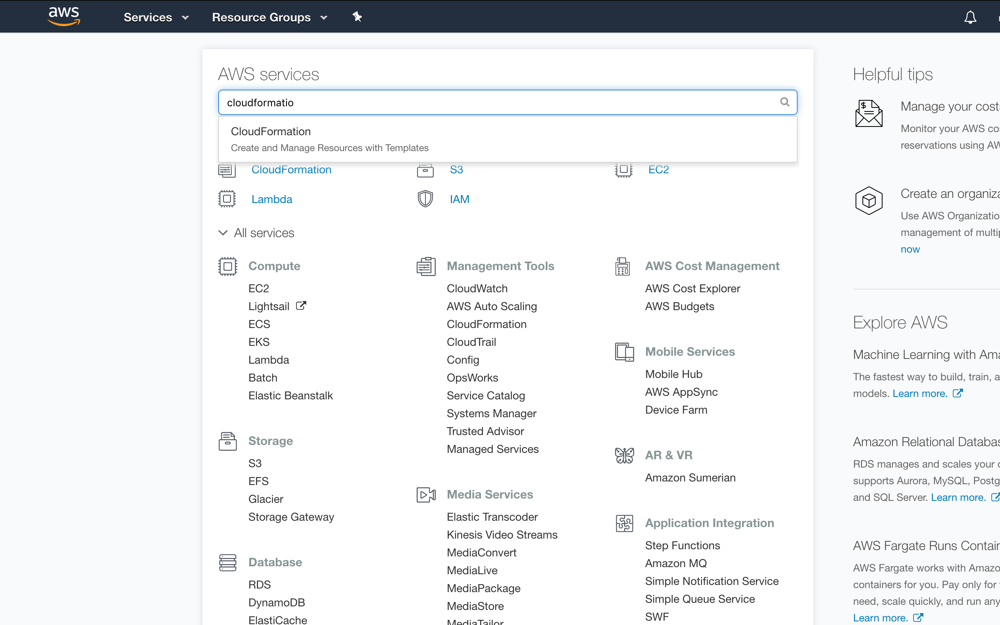
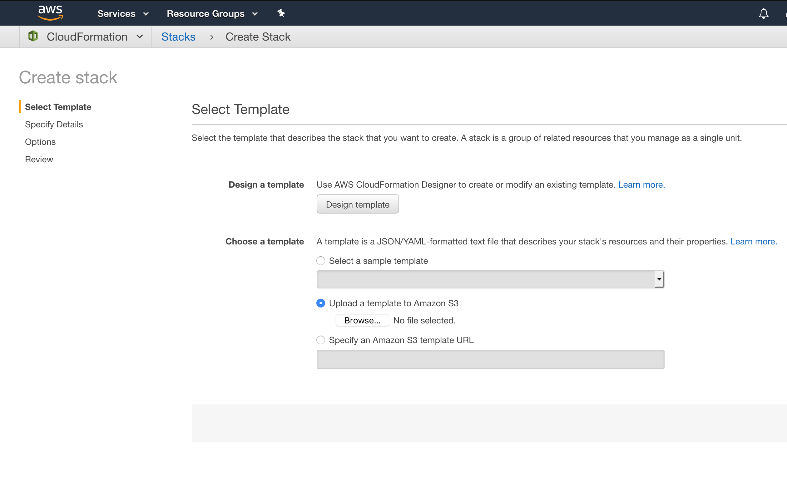
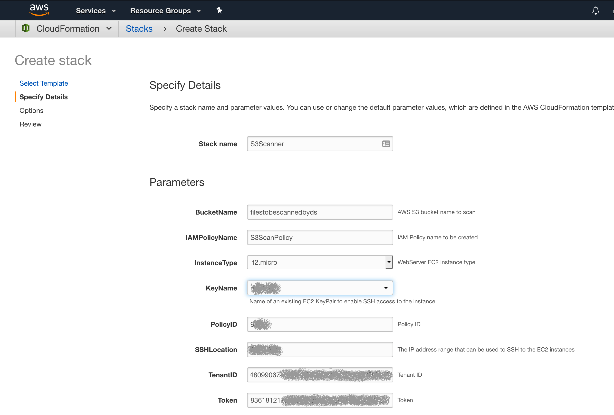
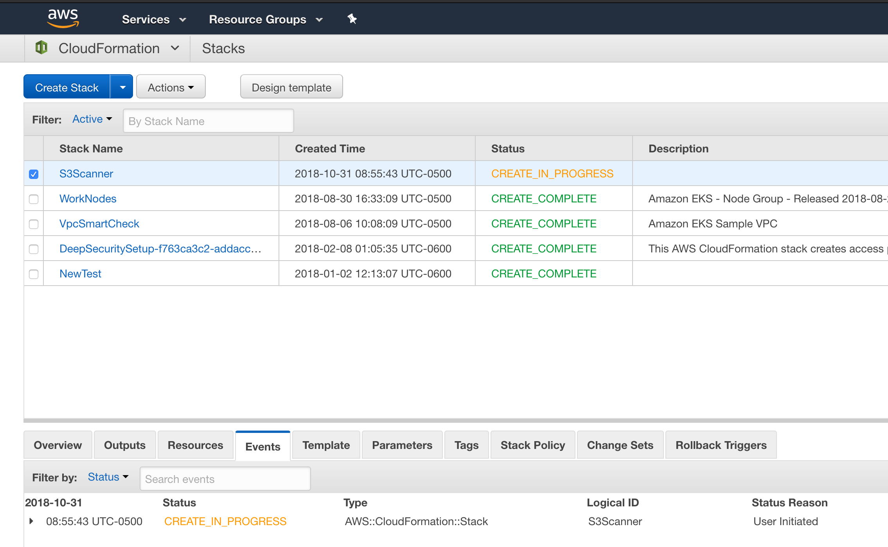
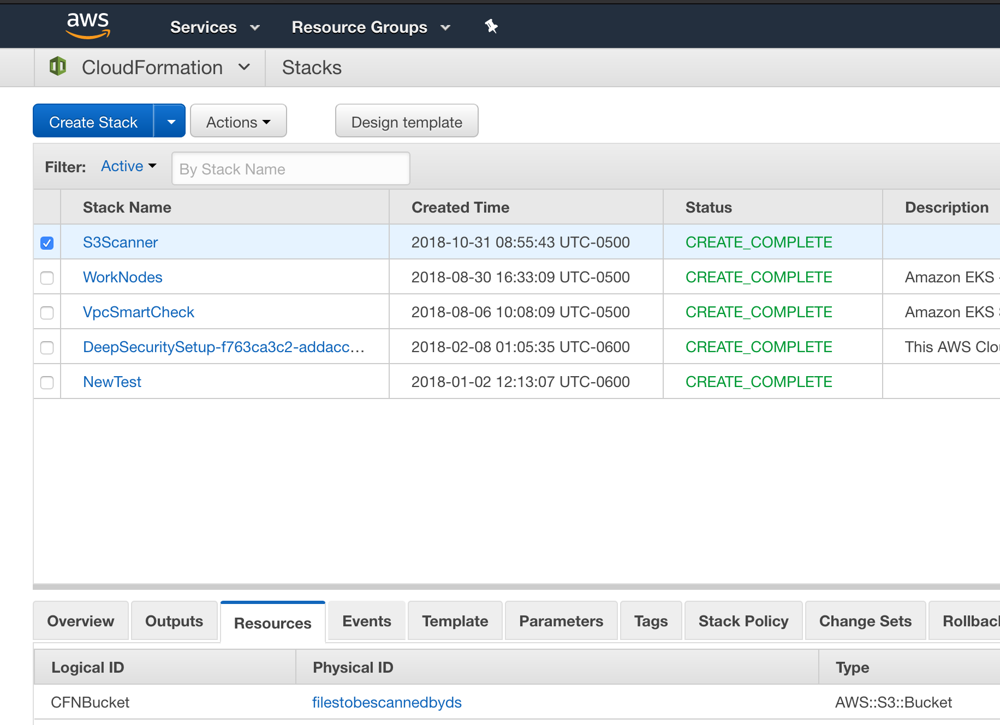
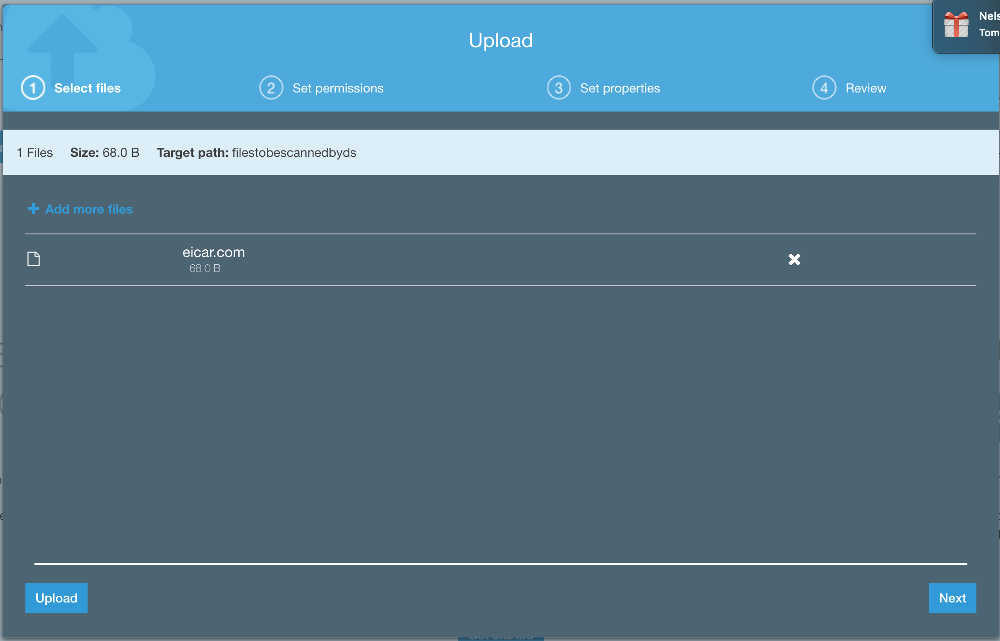
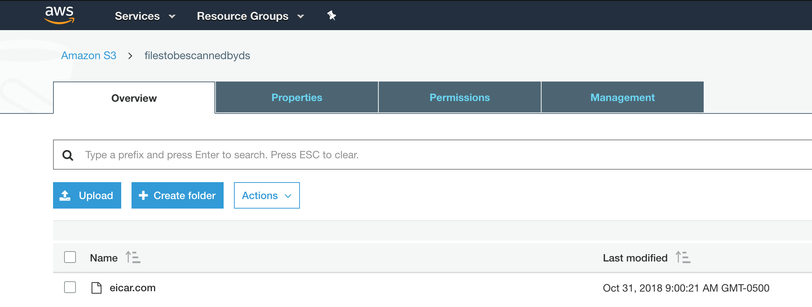

# S3 Scanner Using Deep Security

## Objective

The objetive of this project is to proof the concept of using Deep Security to scan and protect a S3 bucket from malicious objects.

By the end of this documment, you are going to be able to setup a S3 bucket that is going to be scanned by a Deep Security agent, all using a single CloudFormation template file.

## How to Use It

1. First, login to AWS and enter CloudFormation ;)

2. Click on "Create Stack" button.

3. Select "Upload a template to Amazon S3" and select the _cloudformation.json_ file.

4. On this screen yoy need to fill up this form.
  - Stack Name: A name for the Stack (duh)
  - Bucket Name: It must be both a **new** and **globally unique** name for the bucket where the files are going to be pushed to and scanned latter.
  - IAMPolicyName: A account **unique** name for the IAM policies that are going to be created.
  - InstanceType: How big the EC2 instance is going to be.
  - KeyName: A SSH key to later access the EC2 instance if ever needed.
  - PolicyID: The ID (not name!) of the Deep Security policy created for the scanner.
  - SSHLocation: The IP(s) address(es) allowed to SSH into the instance.
  - TentantID: The Tenant ID for your Deep Security as a Service account.
  - Token: The Token used by account to activate a Deep Security agent to the DSaaS.

5. Check the "I aknowledge the AWS CloudFormation might create IAM resources". Because it will.

6. You'll see the stack will start to create itself. Wait for it...

7. Ready! Click on the "Resources" tab. Look for the **CFNBucket** and, by it, click on the bucket name you choose.

8. You'll be redirect to your new S3 bucket window. Click on "Upload".

9. Upload Eicar (or something else...) to the bucket.

10. Now you see it. Refresh (maybe a few times) the page.

11. Now you don't!

## How It Works

1. A file is uploaded to specific S3 bucket
2. A notification is sent to a SNS Topic
3. A SQS queue will consume the notification with the file key.
4. A EC2 instance will keep asking the SQS queue if there is any new entry
5.  Whenever an entry is found, the EC2 will consume the information (file key)
6. The instance will download the file based on the key
7. If the file is a malware, the real time scan will delete it
8. whenever the file is deleted, the script will generate an exception. This will trigger a notification over SNS
9. A Lambda function will be executed because of this notification, deleting the malicious file from S3

## File Structure

- cloudformation.json
  - The main file. It should be used as template for the CloudFormation stack.
- ec2-script/script.py
  - This file is already stored in a public s3 bucket. The EC2 script will download this file and execute it in background fetching the SQS messages, downloading the S3 objects and, if necessery, pushing the notifications to the SNS topic.
- lambda/index.js
  - This file is already stored in a zip file on a public s3 bucket. The lambda created by the stack will use this script to read the SNS notifications and delete the infected objects from the bucket.
