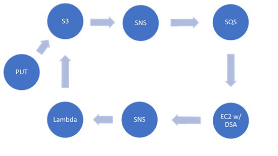

# S3 Scanner Using Deep Security

## Objective

The objetive of this project is to proof the concept of using Deep Security to scan and protect a S3 bucket from malicious objects.

## How to Use It

Use the cloudformation.json file as the template for CloudFormation on AWS.

## How It Works

1. A file is uploaded to specific S3 bucket
2. A notification is sent to a SNS Topic
3. A SQS queue will consume the notification with the file key.
4. A EC2 instance will keep asking the SQS queue if there is any new entry
5.  Whenever an entry is found, the EC2 will consume the information (file key)
6. The instance will download the file based on the key
7. If the file is a malware, the real time scan will delete it
8. whenever the file is deleted, the script will generate an exception. This will trigger a notification over SNS
9. A Lambda function will be executed because of this notification, deleting the malicious file from S3

## File Structure

- cloudformation.json
  - The main file. It should be used as template for the CloudFormation stack.
- ec2-script/script.py
  - This file is already stored in a public s3 bucket. The EC2 script will download this file and execute it in background fetching the SQS messages, downloading the S3 objects and, if necessery, pushing the notifications to the SNS topic.
- lambda/index.js
  - This file is already stored in a zip file on a public s3 bucket. The lambda created by the stack will use this script to read the SNS notifications and delete the infected objects from the bucket.
